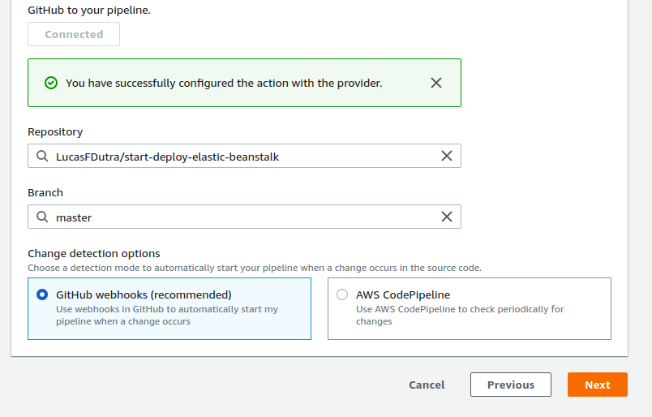
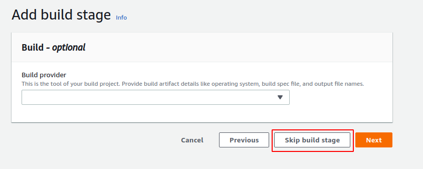

# Objetivo
Criar um sistema de deploy na aws elastic beanstalk de uma aplicação node.

# Instalar
- [node](https://nodejs.org/en/)

# A aplicação
A aplicação é extremamente simples, serve somente para mostrar uma mensagem na tela

- server.js
```JavaScript
const express = require('express');
const app = express();
const routes = express.Router();
routes.get('/', (req, res) => {
    return res.send('hello my world');
});

app.use(routes);

const port = process.env.PORT || 3333;
app.listen(port);
```

# AWS
## Elastic Beanstalk
Basta pesquisar pelo mesmo no console da aws e depois clicar em `Create Application`, e ir preenchendo o que for pedido.


> OBS.: A criação do serviço não é paga, mas me cobrou 1 dolar, mas acredito que seja porque eu estou usando o servidor de São Paulo. Mas fique atento

## Pipeline
O serviço de pipeline é pago, porém tem 30 dias de teste gratuito. O preço é de 1 dolar por mês.

Para criar uma pipeline, pesquise por `CodePipeline`, e depois vá em `create pipeline`.


Agora na tela seguinte apenas de um nome para sua pipeline, e prossiga.


Agora escolha como `Source provider` o github e depois faça a conexão com sua conta.


Depois de sincronizar com sua conta, escolha o repositório do seu projeto e selecione a branch que irá sincronizar, no caso a master. Assim sempre que ocorrer a master for atulizada a pipeline irá mandar essa atualização para o elastic beanstalk.



Na tela seguinte você pode simplesmente ignorar, e mandar pular



Na tela seguinte você deve escolher o elastic beanstalk como deploy provider, a região em que a pipeline ficará, e os nomes da aplicação e ambiente que a pipeline irá atualizar.


Para encontrar os nomes você pode ir no menu `elastic beanstalk` e veja as suas aplicações.


Após preencher as informações, clique em next, e confirme a criação da pipeline.

A pipeline irá fazer a sincronização com o repositório, isso pode demorar um pouquinho, mas nas proximas vezes fica mais rápido, claro, levando em consideração a dimensão dos arquivos modificados.

# Demonstrando o funcionamento
Para acessar ao servidor, abra a aplicação dentro do elastic, e veja que ele fornece uma url. Essa é a url que chama a aplicação


Para testar, eu vou abrir essa url e vou atulizar a mensagem de hello world. Assim que cair no meu repositório a pipeline ativará.


